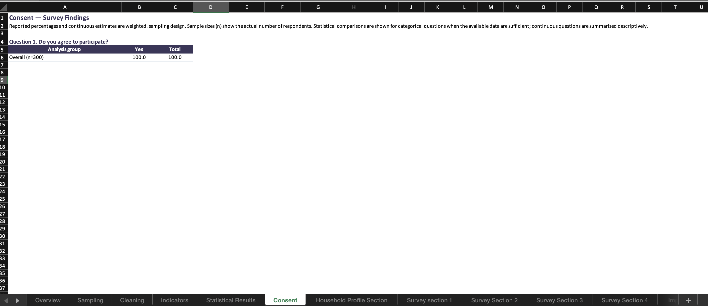

# Kobo-Based Quantitative Survey Analysis

This repository presents a reusable Jupyter notebook originally developed for
a specific Kobo-based quantitative survey and anonymized for use in other
survey contexts.

The notebook integrates XLSForm metadata with response data, keeping data
cleaning, skip logic, derived variables, weighting, indicators, descriptive
statistics, optional inference, and reporting aligned with the survey
instrument. By automating recurring analytical steps while retaining
survey-specific decisions for review, it shortens the path from a Kobo export
to review-ready outputs and improves analytical consistency and traceability.
Its reusable design is particularly relevant to humanitarian and field-based
surveys, where KoboToolbox is commonly used for structured data collection.

Sections marked **Survey-specific** must be reviewed when the notebook is
applied to another survey. The retained methodological choices reflect the
source analysis and should not be treated as defaults for all Kobo-based
surveys.

## Repository Structure

```text
Survey_Analysis.ipynb  Main analyst-facing notebook
survey_utils/
├── kobo_metadata.py            XLSForm metadata and skip logic
├── analysis_utils.py           Data-quality and descriptive functions
├── statistical_utils.py        Categorical and continuous test engines
├── eda_utils.py                EDA plots
└── reporting_utils.py          Excel report formatting
requirements.txt                Python dependencies
LICENSE                         MIT License
```

## Using the Notebook

1. Provide an XLSForm workbook with a `survey` sheet and, when applicable, a
   `choices` sheet.
2. Provide the main respondent-level Kobo export.
3. Update the paths, label language, interview year, and identifier setting.
4. Review every **Survey-specific** section.
5. Run the notebook from top to bottom and review warnings, denominators,
   subgroup bases, and generated outputs.

The notebook supports single-choice, multiple-response, numeric, and open-text
questions; inherited relevance conditions; data-quality checks; derived
variables; indicators; weighted or unweighted descriptives; optional
categorical and continuous inference; EDA; and Excel reporting.

## Methodological Options

### Weighting

| `WEIGHTING_MODE` | Use |
|---|---|
| `post_stratified` | Calculate stratum weights as `N_h / n_h` |
| `precomputed` | Use an approved weight already present in the dataset |
| `none` | Produce unweighted estimates |

Strata do not automatically require weighting. The selected mode must follow
the sampling design and intended estimand.

### Categorical inference

| `INFERENCE_MODE` | Use |
|---|---|
| `survey_design` | Rao–Scott testing with valid weights and design fields |
| `standard` | Unweighted Pearson's chi-square or Fisher's exact test |
| `none` | No categorical hypothesis testing |

Rao–Scott is appropriate only for survey designs that require design-adjusted
categorical inference. Weighted descriptive estimates do not automatically
require Rao–Scott testing.

### Continuous inference

Continuous inference is disabled in the original analysis but remains available
for adaptation through `CONTINUOUS_INFERENCE_MODE`.

| `CONTINUOUS_INFERENCE_MODE` | Use |
|---|---|
| `standard` | Run the included unweighted continuous test engine |
| `none` | Report continuous variables descriptively |

When enabled, the standard engine selects:

- Welch's t-test or Mann–Whitney U for two groups;
- Welch/one-way ANOVA or Kruskal–Wallis for three or more groups;
- Cohen's d, rank-biserial correlation, eta-squared, or epsilon-squared as the
  corresponding effect size.

These are standard unweighted tests. A complex survey may require a separate
design-adjusted continuous method.

## Survey-Specific Review

Before adopting the notebook, review:

- eligibility, duplicate, and consistency rules;
- administrative mappings and analytical categories;
- reference periods and household thresholds;
- strata, population totals, weights, PSU, and FPC fields;
- breakdowns and section assignments;
- indicator calculations, denominators, and targets;
- categorical and continuous inference settings;
- report labels, open-text content, and output paths.

## Excel Reporting

The notebook produces EDA figures and summary tables, overall results,
cross-tabulations, indicator tables, and optional inferential results. The final
Excel export uses stacked, Word-friendly question tables. Each question can show
the overall result followed by **any configured breakdown**. This includes:

- Sex, Age, and Disability Disaggregation (SADD);
- geography and population group;
- household characteristics;
- other survey-specific dimensions configured by the analyst.

The same structure supports categorical, continuous, multiple-response, and
indicator tables. Sample bases remain unweighted respondent counts, while
estimates follow the selected weighting mode.

## Example Output




